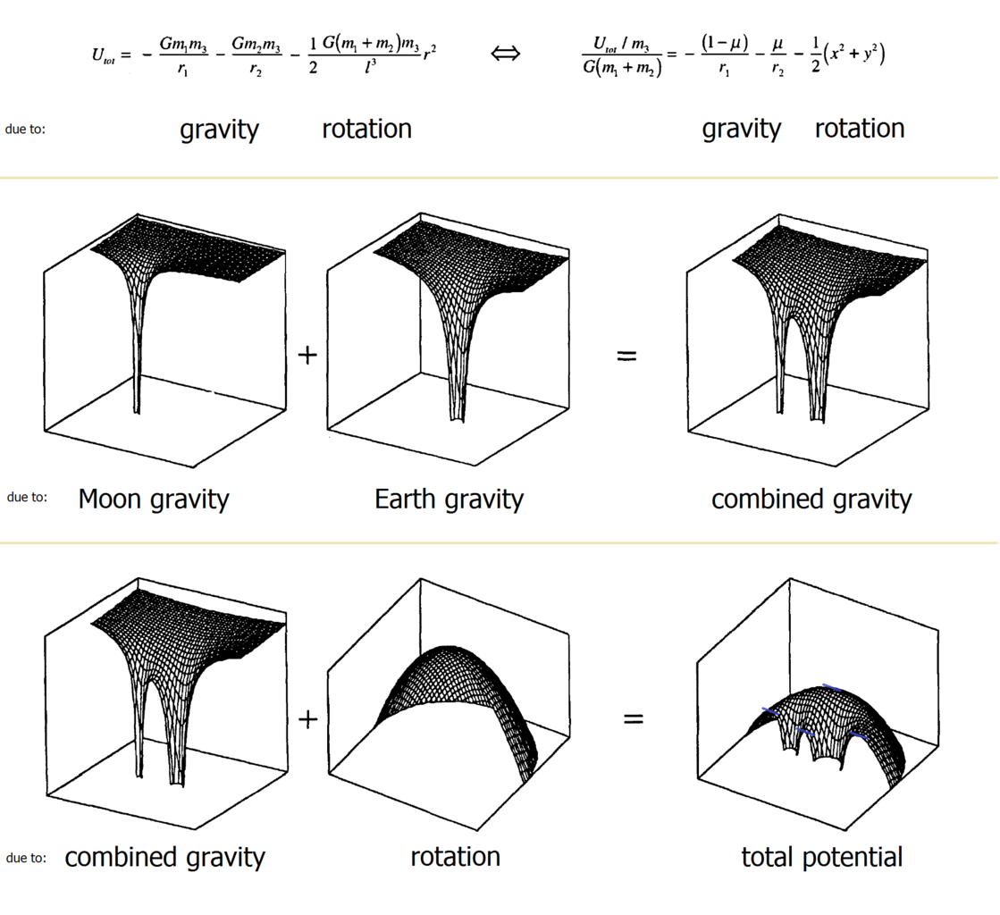

# Three-Body Problem (Newtonian Gravity) — HTML Canvas Simulation

A small, interactive **three-body gravitational simulation** written in plain **HTML/CSS/JS**.
It uses **Newton’s law of universal gravitation** (attractive force proportional to 1/r²) and a stable-ish
numerical integrator (**Velocity Verlet**) to produce **chaotic** motion.

This repo includes:
- A browser simulation with sliders (speed, gravity, softening, substeps, trail settings)
- A **fading trail** for the **third** body
- **Auto-reset** if bodies fly offscreen

## Preview images (generated from the same equations)

These plots are generated offline (Python) just to document what the equations do.

## How to run

1. Save the simulation as `index.html`.
2. Open `index.html` in any modern browser (Chrome/Firefox).
3. Use the **Settings** panel to tune the system in real time.

No build tools. No frameworks. Just physics and pixels.

## Controls

Buttons:
- **Pause / Play**: stops or resumes time integration
- **Reset**: go back to the default initial conditions
- **Randomize (chaotic)**: random initial conditions (still momentum-balanced)
- **Clear trail**: wipes only the trail history

Sliders (what they mean):
- **Speed (time scale)**: multiplies the simulated time advance per frame (lower = slower motion)
- **Gravity (G)**: strength of attraction
- **Softening**: small distance “padding” that prevents infinite force at r → 0
- **Substeps**: how many mini-physics steps happen per animation frame (higher = more stable)
- **Trail length**: number of past points kept for body #3
- **Trail brightness**: multiplies trail opacity (visual only)
- **Auto-reset**: if any body leaves the screen beyond the margin, restart automatically
- **Offscreen margin (px)**: buffer zone outside the canvas before auto-reset triggers

## Physics model

### Newtonian gravity (2D)
Each pair of bodies attracts:
- Force magnitude: \(F = G\,\frac{m_1 m_2}{r^2}\)
- Direction: along the line joining them

In code we apply this as **accelerations** (since \(F = ma\)), and we do it **pairwise** so Newton’s third law
(equal and opposite forces) is respected numerically.

### Softening (why it exists)
If two bodies get extremely close, \(1/r^2\) can explode (infinite acceleration).
Because this simulation runs in discrete timesteps, that can cause “teleporting” or numeric blow-ups.

So we use:
- \(r^2 \leftarrow r^2 + \varepsilon^2\)

This is a common trick in N-body demos and is also used in many astrophysical simulations as a practical approximation.

## Numerical integration

### Velocity Verlet (brief)
A **numerical integrator** is the method that advances the system forward in time.
Velocity Verlet is popular for orbits because it tends to conserve energy better than naive Euler integration.

Per step:
1. Update velocity by half a step using current acceleration  
2. Update position using the half-stepped velocity  
3. Recompute acceleration from the new positions  
4. Finish the velocity update with another half step

This reduces the “energy drift” that makes orbits spiral in/out unrealistically.

## Auto-reset behavior

When **Auto-reset** is enabled, the simulation checks each body’s **screen position**.
If any body crosses:
- x < -margin, x > width + margin, y < -margin, y > height + margin

…then the system resets instantly (using whichever mode you last selected: Reset vs Randomize).

## Performance notes

- Increasing **substeps** increases stability but costs CPU.
- Increasing **trail length** increases draw time (more line segments).
- If you want maximum smoothness, keep substeps moderate (4–8) and trail length ~1000–3000.

## Glossary (new terms, briefly)

- **Three-body problem**: motion of 3 masses under gravity; usually has no closed-form solution and often becomes chaotic.
- **Chaotic**: extremely sensitive to initial conditions (tiny changes cause big differences later).
- **Integrator**: the algorithm that updates positions/velocities over time in a simulation.
- **Velocity Verlet**: an integrator that behaves well for orbital-type physics.
- **Softening (\(\varepsilon\))**: prevents infinite forces at near-zero distance; stabilizes numerics.
- **Substeps**: multiple physics updates per animation frame; increases accuracy and stability.
- **Center of mass**: mass-weighted average position; in an isolated system it moves at constant velocity.
- **Total momentum**: \(\sum m v\); we set initial total momentum ~0 so the system doesn’t drift off.

## References (trusted starting points)

Indian sources:
- **IIT Bombay (EP222 Classical Mechanics)** — central forces and the reduction of two-body motion:  
  https://www.cdeep.iitb.ac.in/slides/A14/EP222/EP222-L15.pdf  (IIT Bombay)
- **IIT Kanpur** — course outline: *Introduction to Celestial Mechanics* (includes 1- and 2-body foundations):  
  https://www.iitk.ac.in/doaa/data/NewCourses/Course-approved-SPA614M-Introduction-to-Celestial-Mechanics.pdf  (IIT Kanpur)
- **NPTEL** — *Space Flight Mechanics* course (central force motion → orbits):  
  https://onlinecourses.nptel.ac.in/noc20_ae06/preview  (NPTEL / IIT)
- **ISRO** — overview material mentioning orbital mechanics activities and orbit types (program context):  
  https://www.isro.gov.in/NSPD2024/assets/pdf/Launch%20Vehicles-Pagewise.pdf  (ISRO)

International fundamentals (high-quality):
- **NASA/JPL** — Orbital mechanics fundamentals:  
  https://spsweb.fltops.jpl.nasa.gov/portaldataops/mpg/MPG_Docs/MPG%20Book/Release/Chapter7-OrbitalMechanics.pdf  (NASA/JPL)
- **NASA SVS** — Kepler’s laws visualized with satellites:  
  https://svs.gsfc.nasa.gov/4642  (NASA)
- **MIT (thesis repository)** — the N-body problem in a formal context:  
  https://dspace.mit.edu/bitstream/handle/1721.1/119107/1059520269-MIT.pdf  (MIT)

## License
MIT
