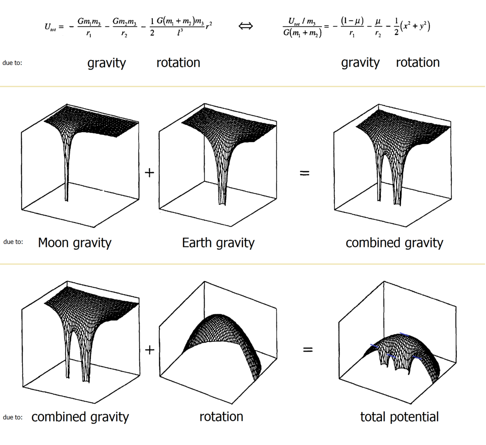
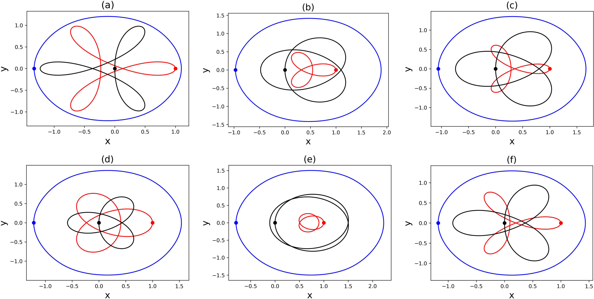

# Three-Body Problem — Newtonian Gravity Simulation

Interactive **3-body gravity simulation** built with plain **HTML/CSS/JS** using **Newtonian gravity** and **Velocity Verlet integration** for stable chaotic motion.

## Features
- Real-time browser simulation
- Adjustable controls:
  - Speed
  - Gravity
  - Softening
  - Substeps
  - Trail settings
- Fading trail for body #3
- Auto-reset when bodies leave screen

## Preview

### Trajectories


### Energy Graph


### Trail Style


---

## Run
1. Save as `index.html`
2. Open in browser
3. Use settings panel

No frameworks or build tools.

## Controls

### Buttons
- **Pause / Play** — stop/resume simulation
- **Reset** — default state
- **Randomize** — chaotic balanced setup
- **Clear trail** — remove trail history

### Sliders
- **Speed** — simulation time scale
- **Gravity (G)** — attraction strength
- **Softening** — prevents infinite force at close distance
- **Substeps** — mini physics steps per frame
- **Trail length** — stored trail points
- **Trail brightness** — trail opacity
- **Auto-reset** — restart if offscreen
- **Offscreen margin** — reset boundary buffer

## Physics

### Newtonian Gravity
Each body attracts others:


- Force acts along connecting line
- Pairwise updates preserve Newton’s third law

### Softening
To avoid infinite acceleration at very small distances:
```
:contentReference[oaicite:1]{index=1}
```
Improves numerical stability.

## Numerical Integration

### Velocity Verlet
A numerical integrator updates positions and velocities over time.

Steps:
1. Half velocity update
2. Position update
3. Recompute acceleration
4. Final half velocity update

Better energy conservation than Euler integration.

## Auto Reset
If enabled, simulation resets when a body crosses:

- `x < -margin`
- `x > width + margin`
- `y < -margin`
- `y > height + margin`

## Performance
- Higher **substeps** = more stability, more CPU
- Longer **trails** = more draw cost
- Recommended:
  - Substeps: `4–8`
  - Trail length: `1000–3000`

## Glossary
- **Three-body problem** — motion of 3 masses under gravity
- **Chaotic** — tiny changes create large future differences
- **Integrator** — algorithm for time updates
- **Velocity Verlet** — orbit-friendly integrator
- **Softening** — avoids infinite force
- **Substeps** — multiple physics updates/frame
- **Center of mass** — weighted average position
- **Momentum** — total motion quantity

## References

### India
- [IIT Bombay — Classical Mechanics](https://www.cdeep.iitb.ac.in/slides/A14/EP222/EP222-L15.pdf)
- [IIT Kanpur — Celestial Mechanics](https://www.iitk.ac.in/doaa/data/NewCourses/Course-approved-SPA614M-Introduction-to-Celestial-Mechanics.pdf)
- [NPTEL — Space Flight Mechanics](https://onlinecourses.nptel.ac.in/noc20_ae06/preview)
- [ISRO — Orbital Mechanics Context](https://www.isro.gov.in/NSPD2024/assets/pdf/Launch%20Vehicles-Pagewise.pdf)

### International
- [NASA/JPL — Orbital Mechanics](https://spsweb.fltops.jpl.nasa.gov/portaldataops/mpg/MPG_Docs/MPG%20Book/Release/Chapter7-OrbitalMechanics.pdf)
- [NASA SVS — Kepler Visualization](https://svs.gsfc.nasa.gov/4642)
- [MIT — N-Body Problem Thesis](https://dspace.mit.edu/bitstream/handle/1721.1/119107/1059520269-MIT.pdf)

## License
MIT
